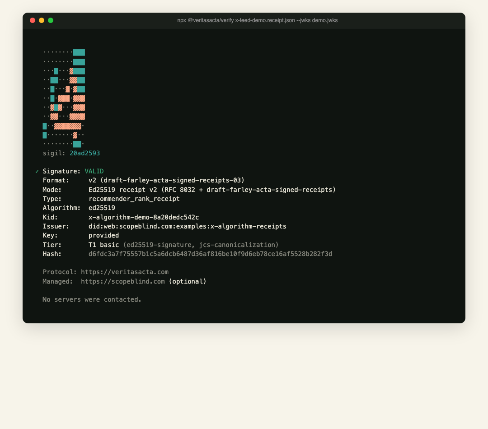
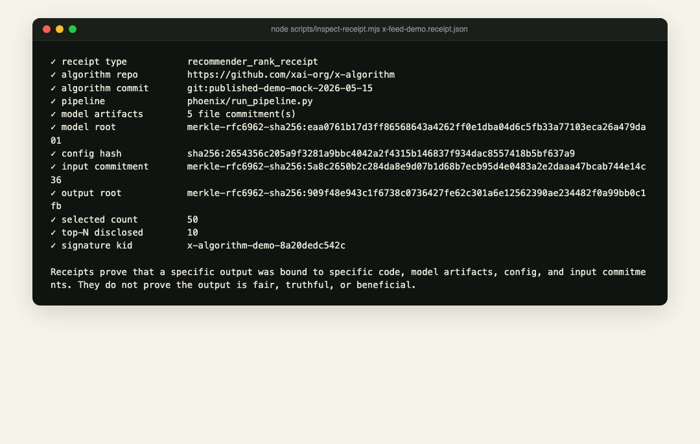
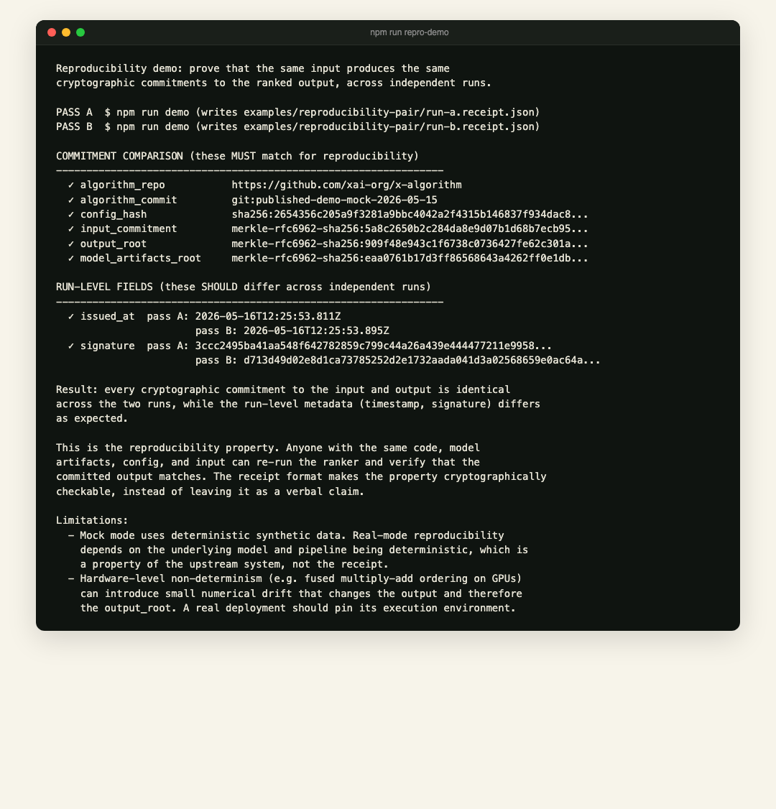

# x-algorithm-receipts

[](https://github.com/VeritasActa/x-algorithm-receipts/actions/workflows/verify-receipt.yml)
[](LICENSE)
[](https://datatracker.ietf.org/doc/draft-farley-acta-signed-receipts/)

Open source shows what could run. Receipts prove what did run.

This repo is a small receipt wrapper for the published [`xai-org/x-algorithm`](https://github.com/xai-org/x-algorithm) demo pipeline. It does not modify X's repo and it does not claim to audit production X. It demonstrates **execution binding**: a specific ranking run can be cryptographically bound to a code commit, model artifact hashes, config hash, input commitment, output Merkle root, and Ed25519 signature.

> **What this proves: execution binding, not ranking quality.** The receipt proves that a specific output was bound to specific code, model artifacts, config, and input commitments at signing time. It does not prove the output is fair, truthful, or beneficial. See [LIMITATIONS.md](LIMITATIONS.md) for the full caveat list.



Three commands to install, verify, inspect:

```sh
npm install
npm run demo                                                        # generate mock receipt
npx @veritasacta/verify examples/x-feed-demo.receipt.json \
  --jwks examples/demo.jwks                                         # verify offline
node scripts/inspect-receipt.mjs examples/x-feed-demo.receipt.json  # inspect semantic fields
```

No accounts, no API keys, no cloud calls. The verifier is open-source Apache-2.0 on npm (`@veritasacta/verify`). The receipt format is documented as an active IETF Internet-Draft, `draft-farley-acta-signed-receipts`.

## What this proves

A valid receipt proves that a specific output was bound to specific code, model artifacts, config, and input commitments at signing time.

It does not prove that the ranking was fair, truthful, beneficial, unbiased, legally sufficient, or actually used in production. Those are different audit problems.

## Receipt inspection (semantic fields)



## Tamper detection

Flip one character anywhere in the signed payload and the verifier rejects the receipt with a spec-cited error.


```sh
npm run tamper-demo
```

This is the core security property of signed receipts: any change to any committed field (algorithm commit, model hashes, config, input, output) invalidates the signature. There is no way to selectively edit the payload without re-signing it.

## Reproducibility

Run the wrapper twice with the same input. The two receipts have different `issued_at` timestamps and signatures, but the cryptographic commitments to the input and the ranked output match exactly.



```sh
npm run repro-demo
```

This demonstrates how reproducibility can be made **cryptographically checkable** when the same input and artifacts are re-run. Whether a production recommender is itself reproducible is a property of that system, not of the receipt format. The receipt makes any mismatch immediately visible field-by-field. See [LIMITATIONS.md](LIMITATIONS.md#reproducibility-mock-vs-reproducibility-production) for the mock-vs-production distinction.

Committed pair lives in [`examples/reproducibility-pair/`](examples/reproducibility-pair/). To regenerate (with fresh timestamps) the committed example pair, run `npm run repro-demo -- --update-committed`. By default, the script writes to a gitignored `.repro-tmp/` directory so re-runs don't dirty the committed examples.

## Issuer-blind disclosure demo (v0.4.0)

The v0.3 receipt proves execution binding. v0.4 adds the next layer: a local BRASS/VOPRF-gated disclosure demo showing how an authorized researcher can unlock a scoped opening without the issuer learning which receipt or policy was later used.

```sh
npm run voprf-demo
npm run unlinkability-demo
```

`npm run voprf-demo` verifies the real receipt, issues a local BRASS-style VOPRF token for `dsa-researcher:top-10`, verifies issuer and client DLEQ proofs, then opens only the top 10 structured ranked items. Each disclosed row is checked against the signed `ranked_items_root` with a Merkle proof.

Committed fixtures live in [`examples/voprf-gated-disclosure/`](examples/voprf-gated-disclosure/):

| Fixture | Purpose |
|---|---|
| `researcher-top10.disclosure.json` | Top-10 structured disclosure bundle with per-row Merkle openings. |
| `gated-disclosure.attestation.json` | Signed attestation over the disclosure hash, token nullifier hint, and receipt id. |
| `gated-disclosure.jwks` | Public key for the disclosure attestation. |
| `unlinkability-demo.json` | Issuer-view vs verifier-view transcript showing the privacy boundary. |

Important: this is a **local demo** of the same BRASS/VOPRF token shape used by the ScopeBlind stack. It does not call the production issuer at `api.scopeblind.com`. The commercial layer is managed issuance, policy-tiered disclosure, retention, and audit-room UX. The open layer remains the receipt format and offline verifier.

## Real mode against an actual Phoenix pipeline (v0.3.0)

The repo ships a real-mode receipt at [`examples/x-feed-real.receipt.json`](examples/x-feed-real.receipt.json) bound to a real ranking pass against `xai-org/x-algorithm@0bfc2795d308f90032544322747caacd535f75ae`. Verify it the same way as the mock receipt:

```sh
npx @veritasacta/verify examples/x-feed-real.receipt.json --jwks examples/real.jwks
node scripts/inspect-receipt.mjs examples/x-feed-real.receipt.json
```

To reproduce yourself, clone X's repo, download the Phoenix artifacts (2.9 GB via Git LFS), and run the wrapper:

```sh
git clone https://github.com/xai-org/x-algorithm.git ./x-algorithm
# Follow upstream instructions to place Phoenix artifacts under:
# ./x-algorithm/phoenix/artifacts/oss-phoenix-artifacts

node scripts/run-x-algorithm-with-receipt.mjs \
  --x-algorithm-dir ./x-algorithm \
  --artifacts-dir ./x-algorithm/phoenix/artifacts/oss-phoenix-artifacts \
  --receipt-out receipts/x-feed-real.receipt.json \
  --jwks-out receipts/x-feed-real.jwks \
  --require-structured

npx @veritasacta/verify receipts/x-feed-real.receipt.json --jwks receipts/x-feed-real.jwks
node scripts/inspect-receipt.mjs receipts/x-feed-real.receipt.json
```

The real wrapper executes `uv run run_pipeline.py` inside `x-algorithm/phoenix` as a subprocess, hashes all source/model/config/corpus files, captures the exact stdout and stderr bytes the pipeline produced, parses Phoenix's ranked table into structured top-N records, signs the audit event, and writes a local JWKS for offline verification.

**Wording precision matters here:** v0.3.0 has two output commitments. `output_root` still commits to the exact Phoenix pipeline stdout lines, preserving byte-level reproducibility checks. `ranked_items_root` commits to parsed structured `{rank, post_id, score, probabilities, topics}` records, giving auditors a semantic top-N disclosure surface. A re-runner who reproduces the same pipeline output and parser result reproduces both roots. See [LIMITATIONS.md](LIMITATIONS.md#real-mode-has-byte-level-and-structured-output-commitments) for the full nuance.

## Browser verifier (no CLI required)

Drop a receipt and JWKS at https://www.scopeblind.com/verify-receipt. Receipt contents are verified locally in your browser using `@noble/curves`; receipt contents are not uploaded. (Static assets load from Cloudflare Pages and the optional "Load example" button fetches from jsDelivr.)

## Receipt profile

The receipt type is `recommender_rank_receipt` with profile `recommender.post_ranking.v1`.

Core payload fields:

| Field | Meaning |
|---|---|
| `algorithm_repo` | Source repository for the algorithm implementation. |
| `algorithm_commit` | Git commit hash for the checked-out algorithm source. |
| `algorithm_source_root` | Merkle root over source files used by the wrapper. |
| `pipeline` | Pipeline entry point, currently `phoenix/run_pipeline.py`. |
| `model_artifacts` | Per-file SHA-256 commitments for model/config/corpus artifacts. |
| `model_artifacts_root` | Merkle root over `model_artifacts`. |
| `config_hash` | Hash over config artifact commitments. |
| `input_commitment` | Merkle root over private or selectively disclosable input references. |
| `output_root` | Merkle root over exact stdout-line commitments. |
| `output_top_n_optional` | Optional selectively disclosed stdout-line sample. |
| `ranked_items_root` | Merkle root over parsed structured ranked records. |
| `ranked_items_top_n_optional` | Optional selectively disclosed structured top-N records. |
| `selected_count` | Count of committed ranked outputs. |
| `caveat` | Explicit limitation of the proof claim. |

See [`docs/audit-event-schema.md`](docs/audit-event-schema.md) and [`schemas/recommender-post-ranking-v1.schema.json`](schemas/recommender-post-ranking-v1.schema.json).

Release notes: [`CHANGELOG.md`](CHANGELOG.md).

## Why a wrapper, not a PR?

At the time this was built, the upstream repository had Issues, Discussions, Wiki, and external PR creation all disabled. A wrapper keeps the contribution vendor-neutral and avoids asking xAI to adopt any receipt format. If a channel ever opens upstream, the minimal shape is an optional post-ranking audit event that external systems can sign however they choose.

## Proposed upstream hook (RFC)

Full RFC: [#1 RFC: Add optional post-ranking audit event hook](https://github.com/VeritasActa/x-algorithm-receipts/issues/1).

```rust
pub struct RankAuditEvent {
    pub algorithm_commit: String,
    pub model_artifacts: Vec<ArtifactRef>,
    pub config_hash: String,
    pub input_commitment: String,
    pub output_root: String,
    pub output_top_n_optional: Option<TopNOpening>,
    pub timestamp: i64,
}
```

No signing requirement. No policy engine. No external service dependency. The hook only emits structured evidence; signing and anchoring stay outside the core ranking pipeline. The RFC is filed here on the companion repo because upstream Issues are disabled; if xAI opens a channel, the proposal copies over verbatim.

## License

Apache-2.0. This repo is independent of `xai-org/x-algorithm`; use that repository under its own license and terms.
